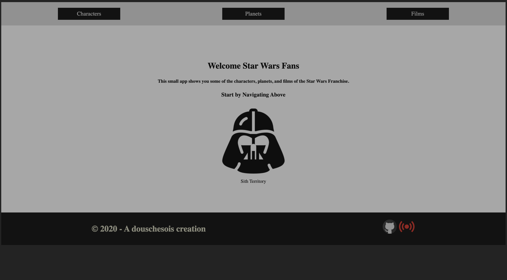
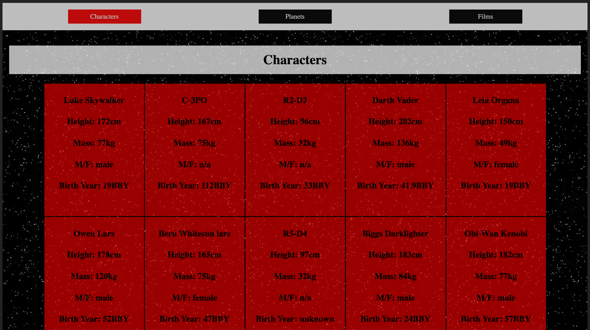
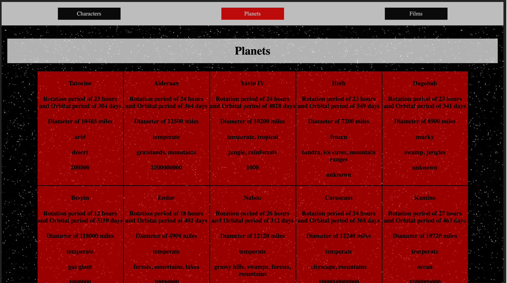
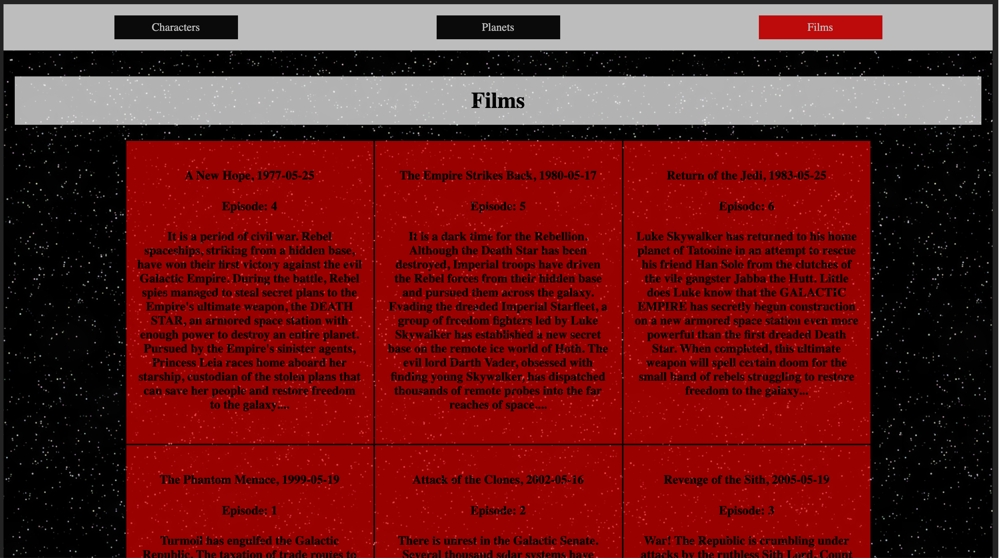

# React-Star-Wars-API App

This is an App that connects to the Star Wars API and displays information about the franchise such as the characters, planets, and films.

Live Link: {}

<h2>Summary</h2>
I am a star wars fan and my favorite character has to be Darth Vador. I like his story and his character development throughout the films. I developed this App because I wanted to work with the Star Wars API. I retrieve data from the API using fetch and display it on a card. I used Link to navigate through the routes and also decided to implement useEffect and useState hooks. I learned new concepts and how to fetch data from APIs and solified my understanding of how to use react hooks specically useEffect and useState.

<h2>Author</h2>

Roger Alexander - Full Stack Developer
